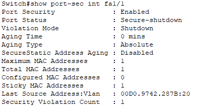

This project showcases the design, configuration, and security of a small office network using Cisco Packet Tracer. The goal was to create a functional and secure network that simulates real-world scenarios while demonstrating key networking and cybersecurity skills.

## Table of Contents
- [1. Network Planning](#1-network-planning)
- [2. Building the Network](#2-building-the-network)
  - [2.1 Physical Setup](#21-physical-setup)
  - [2.2 Configuring Basic Networking](#22-configuring-basic-networking)
- [3. VLAN Configuration and Inter-VLAN Routing](#3-vlan-configuration-and-inter-vlan-routing)
  - [3.1 VLAN Configuration](#31-vlan-configuration)
  - [3.2 Inter-VLAN Routing](#32-inter-vlan-routing)
- [4. DHCP Configuration](#4-dhcp-configuration)
- [5. NAT Configuration](#5-nat-configuration)
  - [5.1 Configuring NAT](#51-configuring-nat)
  - [5.2 Configuring Test Endpoint](#52-configuring-test-endpoint)
  - [5.3 Configuring Routing](#53-configuring-routing)
  - [5.4 Testing](#54-testing)
- [6. Network Security](#6-network-security)
  - [6.1 Port Security](#61-port-security)
  - [6.2 Access Control Lists (ACLs)](#62-access-control-lists-acls)
  - [6.3 Secure Management](#63-secure-management)
- [7. Conclusion](#7-conclusion)

## Objectives:
- **Plan and configure** a structured office network.
- **Implement VLAN segmentation** to isolate network traffic.
- **Enhance network security** using **Port Security, ACLs, and SSH**.
- **Validate security controls** through structured testing.

## Skills Demonstrated:
- **Networking design and implementation** with VLANs, IP addressing and DHCP.
- **Security enforcement** using **Access Control Lists (ACLs), Port Security, and SSH**.
- Troubleshooting and mitigation of network issues  
<br><br>

---  

<br>

## 1. Network Planning

**Objective: Design the initial layout of the network and define departments**

A network diagram was created to represent a small office network with three departments: Management, HR and IT.


*Figure 1: Network Diagram showing the planned layout of the office network*

As displayed in figure 1, the network has 3 switches connected to a router, each switch is assigned to a department and has 2 PCs and a server per switch. The departments each have their own VLAN, subnets assigned as follows:  
- IT Department (VLAN 10 - 192.168.1.0/24): Manages technical infrastructure, provides support, and maintains IT services. IT can communicate with HR but cannot access HR servers.
- Management Department (VLAN 20 - 192.168.2.0/24): Consists of executives overseeing business operations. Management can communicate with IT and HR but cannot access their servers and vice versa.
- HR Department (VLAN 30 - 192.168.3.0/24): Handles employee records, payroll, and HR policies. HR can communicate with IT but cannot access IT servers.
<br><br>

---  

<br>


## 2. Building the Network

**Objective: Create the physical and logical setup of the network in Packet Tracer**

This section covers the physical setup of the network in packet tracer and verifying intra-subnet communication.

### 2.1 Physical Setup

**Objective: Setup the physical network in packet tracer and connect devices**

The physical network was created in packet tracer according to the plan, devices were connected using copper straight-through cables.

<br>
*Figure 2.1.1: The network built in packet tracer*

### 2.2 Configuring Basic Networking

**Objective: Configure basic networking to allow intra-subnet communication**

The devices within each department were assigned static IP's and communication was successful:  
IT: 192.168.1.x  Gateway: 192.168.1.1  
Management: 192.168.2.x  Gateway: 192.168.2.1  
HR: 192.168.3.x  Gateway: 192.168.3.1  

<br>
*Figure 2.2.1: Shows IP configuration of a PC within IT department*

<br>
*Figure 2.2.2: Shows a successful ping between 2 devices within the IT subnet*
<br><br>

---  

<br>


## 3. VLAN Configuration and Inter-VLAN Routing
 
**Objective: Segment traffic using VLANs and enable communication between VLANs**

### 3.1 VLAN Configuration

**Objective: Segment the network into three VLANs for IT, Management and HR to improve traffic isolation**

Configuration Details:  
VLANs were configured on their respective switches:
- IT (VLAN 10): Ports FastEthernet0/1, FastEthernet 1/1, FastEthernet2/1  
- Management (VLAN 20): Ports FastEthernet0/1, FastEthernet 1/1, FastEthernet2/1  
- HR (VLAN 30): Ports FastEthernet0/1, FastEthernet 1/1, FastEthernet2/1  

Trunk Ports: FastEthernet3/1 on each router, configured to carry traffic for all VLANs to the router  
Without trunk ports, devices in different VLANs wouldn't be able to communicate.

#### VLAN Creation:

```bash
# Code for the creation of the IT VLAN 10
Switch enable
Switch# configure terminal
Switch(config)# vlan 10             # Creates VLAN 10
Switch(config-vlan)# name IT        # Name VLAN 10 "IT"
Switch(config-vlan)# exit           # Exit VLAN config mode
```

#### Assign ports to the VLAN:

```bash
# Port assignment for VLAN 10
Switch(config)# interface range Fa0/1, Fa1/1, Fa2/1     # Enter interface config mode for the 3 ports
Switch(config-if-range)# switchport mode access         # Change the port mode to access
Switch(config-if-range)# switchport access vlan 10      # Assign the ports to VLAN 10  
Switch(config-if-range)# exit                           # Exit interface config
```

#### Configure the Trunk port:

```bash
# Trunk port config for all VLANs
Switch(config)# interface Fa3/1             # Enter configuration interface for port Fa3/1
Switch(config-if)# switchport mode trunk    # Configure Fa3/1 as a trunk
Switch(config-if)# exit                     # Exit interface config mode
```  

> This configuration sets FastEthernet3/1 as a trunk port to carry traffic for all VLANs ensuring interswitch routing and connectivity to the router.


Below are the outputs of the commands `show vlan brief` (*Figure 3.1.1*) and `show interfaces trunk` (*Figure 3.2.2*) which verify the creation of the VLAN and the assignment of the trunk port respectively:

<br>
*Figure 3.1.1: Verification of VLAN configuration using `show vlan brief`*

<br>
*Figure 3.1.2: Verification of Trunk configuration using `show interfaces trunk`*

Now that the VLANs have been successfully created and configured, the next step is to configure inter-vlan routing to enable communication between the departments.

### 3.2 Inter-VLAN Routing

**Objective: Enable inter-VLAN communication through the configuration of a router**

Router-on-a-Stick will be used to enable communication between the VLANs. RoaS is an inter-VLAN routing method where a single router interface is divided into multiple logical interfaces (subinterfaces), each representing a VLAN. The router is connected to the switch via a single cable which allows it to logically communicate with all VLANs using 802.1q tagging. This tagging applies a unique identifier to each packet, ensuring it is associated with the correct VLAN.

> **Troubleshooting: Router Subinterface Issue**  
Whilst configuring RoaS it was discovered that the 819HGW router doesn't support sub-interfaces, a critical feature for handling multiple VLANs on a single physical connection. As a result it was replaced with the Cisco 1841 router.

> **Troubleshooting: Port Compatibility Issue**  
During the setup of inter-switch trunk links, it was discovered that the Fa3/1 ports used as trunks on the HR and IT switches don't support fibre optic cables, whilst the Fa4/1 and Fa5/1 ports on the management switch only support fibre optic. As a result, the trunk ports were reassigned to improve compatibility.

```bash
# An example of the trunk reassigment on the IT switch
IT-Switch(config)# interface fastethernet3/1
IT-Switch(config-if)# no switchport mode trunk  # Remove trunk from Fa3/1

IT-Switch(config)# interface fastethernet4/1
IT-Switch(config-if)# switchport mode trunk     # Assign Fa4/1 as a trunk
IT-Switch(config-if)# no shutdown
```

#### Creating Subinterfaces for VLANs:

For RoaS to enable inter-VLAN communication, it is necessary to create subinterfaces on the router for each VLAN. Each subinterface acts as the gateway for its respective VLAN and uses 802.1q encapsulation to tag traffic with the appropriate VLAN id.

```bash
# Example for VLAN 10 (IT)
Router> enable
Router# configure terminal
Router(config)# interface fastethernet0/0.10                    # Create a subinterface for VLAN 10 on the router's Fa0/0 interface
Router(config-subif)# encapsulation dot1Q 10                    # Enable 802.1q tagging for VLAN 10
Router(config-subif)# ip address 192.168.1.1 255.255.255.0      # Assign the default gateway ip address for VLAN 10

# Process repeated for VLAN 20 (Management) and VLAN 30 (HR)
```
> Note: 802.1q tagging is essential for RoaS as it ensures that packets are routed correctly between VLANs

<table>
  <thead>
    <tr>
      <th>Subinterface</th>
      <th>VLAN ID</th>
      <th>IP Address</th>
      <th>Purpose</th>
    </tr>
  </thead>
  <tbody>
    <tr>
      <td>Fa0/0.10</td>
      <td>10</td>
      <td>192.168.1.1/24</td>
      <td>IT Department</td>
    </tr>
    <tr>
      <td>Fa0/0.20</td>
      <td>20</td>
      <td>192.168.2.1/24</td>
      <td>Management Department</td>
    </tr>
    <tr>
      <td>Fa0/0.30</td>
      <td>30</td>
      <td>192.168.3.1/24</td>
      <td>HR Department</td>
    </tr>
  </tbody>
</table>

<br>
*Figure 3.2.1: Successful creation of subinterfaces*


<br>
*Figure 3.2.2: Routing table using command `show ip route`*

> The router has now been successfully configured with subinterfaces for VLANs 10, 20 and 30. Each subinterface is tagged with its own VLAN and assigned a default gateway IP address. The routing table shows that subnets 192.168.1.0/24, 192.168.2.0/24 and 192.168.3.0/24 are directly connected to subinterfaces Fa0/0.10, Fa0/0.20 and Fa0/0.30 respectively, this ensures that inter-VLAN communication is possible.

#### Reconfigure Trunk Ports due to Compatibility Issues

Trunk ports were configured previously in [Configure the Trunk Port](#configure-the-trunk-port), however these must be reconfigured due to compatibility issues.

```bash
# Process to reassign trunks on IT and HR switches
Switch# configure terminal
Switch(config) interface fastethernet3/1
Switch(config-if) no switchport mode trunk    # Disable Fa3/1 as trunk
Switch(config-if) exit
# Fa4/1 and Fa5/1 then assigned as trunks
```

```bash
# Assigning trunk ports on Management switch
Switch(config)# interface fastethernet4/1
Switch(config-if)# switchport mode trunk
Switch(config-if)# switchport trunk allowed vlan 10,20,30
Switch(config-if)# no shutdown

Switch(config)# interface fastethernet5/1
Switch(config-if)# switchport mode trunk
Switch(config-if)# switchport trunk allowed vlan 10,20,30
Switch(config-if)# no shutdown
```
> Note: Management switch now has 3 active trunk ports, Fa3/1, Fa4/1 and Fa5/1. The other departments have 2, Fa4/1 and Fa5/1

<br>
*Figure 3.2.3: Trunk ports configured on management switch and VLANs allowed access*

Trunk ports have now been successfully configured on the Management switch for VLANs 10, 20 and 30, thus ensuring proper VLAN tagging and traffic flow between the router and switches.

#### Inter-VLAN Communication Testing

Inter-VLAN communication was tested by pinging devices in different VLANs.

<br>
*Figure 3.2.4: A ping from IT PC-1 (192.168.1.10) in VLAN 10 to Management PC-1 (192.168.2.10) VLAN 20*

<br>
*Figure 3.2.5: A ping from HR PC-1 (192.168.3.10) in VLAN 30 to IT PC-1 (192.168.1.10) VLAN 10*

As shown above, inter-VLAN communication and routing is working as intended, the router has successfully forwarded traffic between VLANs using the subinterfaces.


*Figure 3.2.6: An annotated image of the network build at this stage*

Figure 3.2.6 displays the updated network topology with the RoaS connection, the trunk ports are labelled along with the information about each department.
<br><br>

---  

<br>


## 4. DHCP Configuration

**Objective: Automate IP address assignment across the network for devices in VLANs, IT, Management and HR**

Dynamic Host Configuration Protocol (DHCP) is a protocol used to automatically assign IP addresses and other network configuration parameters (e.g. subnet mask, gateway). As a result of this, DHCP is an incredibly useful tool in networking, it has several key benefits:
1. Automation:
- DHCP eliminates the need to manually assign IPs, increasing efficiency and reducing errors.
2. Flexibility and Scalability:
- Devices can easily join the network and obtain an IP, very useful for large scale networks.
3. Dynamic Updates:
- Reclaims unused IPs when devices leave the network, ensuring efficient utilisation of IPs.
4. Centralised Management:
- IP assignments can be controlled from a single DHCP server

In this project, DHCP was configured on the router to automatically assign IP addresses to devices in each of the VLANs. While this isn't strictly necessary for a network of this size, I decided to implement it, for the sake of scalability, adding a touch of complexity and getting practical experience with dynamic IP address allocation.

**DHCP Configuration Plan:**

<table>
  <thead>
    <tr>
      <th>VLAN</th>
      <th>Subnet</th>
      <th>Excluded IPs</th>
      <th>DHCP Pool Range</th>
      <th>Gateway</th>
    </tr>
  </thead>
  <tbody>
    <tr>
      <td>IT (VLAN 10)</td>
      <td>192.168.1.0/24</td>
      <td>192.168.1.1 – 192.168.1.11</td>
      <td>192.168.1.12 – 192.168.1.254</td>
      <td>192.168.1.1</td>
    </tr>
    <tr>
      <td>Management (VLAN 20)</td>
      <td>192.168.2.0/24</td>
      <td>192.168.2.1 – 192.168.2.11</td>
      <td>192.168.2.12 – 192.168.2.254</td>
      <td>192.168.2.1</td>
    </tr>
    <tr>
      <td>HR (VLAN 30)</td>
      <td>192.168.3.0/24</td>
      <td>192.168.3.1 – 192.168.3.11</td>
      <td>192.168.3.12 – 192.168.3.254</td>
      <td>192.168.3.1</td>
    </tr>
  </tbody>
</table>
<p><strong>Note:</strong> Excluded IP ranges are reserved for static assignments to critical devices like servers and routers.</p>
<br><br>

---

<br>

### DHCP Configuration Steps

#### Excluding Static IPs

```bash
Router(config)# ip dhcp excluded-address 192.168.1.1 192.168.1.11    # Specifies the address range to exclude
Router(config)# ip dhcp excluded-address 192.168.2.1 192.168.2.11
Router(config)# ip dhcp excluded-address 192.168.3.1 192.168.3.11
```

This ensures that static IP addresses are not automatically assigned by DHCP.

<br>
*Figure 4.1: Verifies the excluded static IP address range*

#### Create DHCP pools for each VLAN

```bash
Router(config)# ip dhcp pool VLAN10                     
Router(dhcp-config)# network 192.168.1.0 255.255.255.0      # Define the subnet
Router(dhcp-config)# default-router 192.168.1.1             # Gateway for this VLAN
Router(dhcp-config)# dns-server 8.8.8.8                     # Specify DNS server
Router(dhcp-config)# exit

# Process repeated for vlan 20 and 30
```

> Note: DNS server specification is optional here but will be relevant when working with NAT. 8.8.8.8 is the Google Public DNS.

#### DHCP Testing

To test the DHCP IP allocation, two new PC's were added to the network, one to the IT department(VLAN 10), and the other to HR (VLAN 30). The PC's were set to DHCP IP allocation, shown below are the results.

<br>
*Figure 4.2: Clearly displays DHCP allocation from the PC configuration page, IP outside of excluded range*

The systems were able to ping their respective gateway addresses and also were capable of intra/inter VLAN communication.  
<br>
*Figure 4.3: Ping from PC in IT VLAN with auto assigned DHCP IP to it's gateway, confirming network connectivity*

By using the command `show ip dhcp binding` we are also able to see the devices that have been dynamically allocated IPs.   
<br>
*Figure 4.4: Output of `show ip dhcp binding` which displays the IPs allocated and hardware addresses of the devices*

> The DHCP server was successfully configured to dynamically allocate IP addresses whilst ignoring IPs within the excluded range. Devices were tested for connectivity and passed.
<br><br>

---

<br>

## 5. NAT Configuration

**Objective: Enable devices within internal network to access external networks by configuring NAT on the router**

Network Address Translation (NAT) is used to modify packets as they pass through a router. It's a method to map multiple private IP addresses within a network onto a public IP address, enabling communication with external networks whilst maintaining the security of the internal network.
There are several types of NAT:
1. Static NAT - One private IP is mapped to one public IP (1-1 Translation)
2. Dynamic NAT - A pool of public IP's is assigned dynamically to private IPs
3. Dynamic NAT with PAT - Multiple devices share one public IP by using different ports

For this project I will be using Dynamic NAT with PAT as it provides scalability and an efficient usage of ip addresses. For the purpose of testing NAT I will also be setting up an "ISP" router to simulate an external network connection and creating a "Google" server (8.8.8.8) to act as a test endpoint.

<table>
  <thead>
    <tr>
      <th>Component</th>
      <th>Configuration</th>
    </tr>
  </thead>
  <tbody>
    <tr>
      <td>Internal Networks</td>
      <td>192.168.1.0/24 (IT), 192.168.2.0/24 (Management), 192.168.3.0/24 (HR)</td>
    </tr>
    <tr>
      <td>Public IP</td>
      <td>203.0.113.1 (Router's Fa0/1 interface)</td>
    </tr>
    <tr>
      <td>NAT Type</td>
      <td>Dynamic NAT with PAT</td>
    </tr>
    <tr>
      <td>Access Control List (ACL)</td>
      <td>Permit traffic from internal networks (192.168.1.0, 192.168.2.0, 192.168.3.0)</td>
    </tr>
  </tbody>
</table>

> Internal VLANs (IT, Management and HR) will share one public IP (203.0.113.1)  
PAT assigns unique port numbers to track sessions


### 5.1 Configuring NAT

**Objective: Configure Dynamic NAT with PAT to allow communication between devices in internal VLANs and external networks**

#### Define NAT Outside and Inside Interfaces

To enable NAT, the internal VLAN subinterfaces were defined as inside interfaces, while the public facing Fa0/1 interface (connected to the ISP) was defined as outside.

```bash
Router(config)# interface fastethernet0/0
Router(config-if)# ip nat inside                # Defines Fa0/0 as inside (internal network)

Router(config)# interface fastethernet0/0.10
Router(config-subif)# ip nat inside             # IT VLAN

Router(config)# interface fastethernet0/0.20
Router(config-subif)# ip nat inside             # Management VLAN

Router(config)# interface fastethernet0/0.30
Router(config-subif)# ip nat inside             # HR VLAN

Router(config)# interface fastethernet0/1
Router(config-if)# ip nat outside               # Defines Fa0/1 as outside (external network)
```


 <br>
*Figure 5.1.1: Output displays that inside and outside interfaces have been correctly assigned*

#### Create an ACL to Permit Internal Traffic

An access control list was created to specify which internal subnets are allowed to be translated using NAT.

```bash
Router(config)# access-list 1 permit 192.168.1.0 0.0.0.255    # IT VLAN
Router(config)# access-list 1 permit 192.168.2.0 0.0.0.255    # Management VLAN
Router(config)# access-list 1 permit 192.168.3.0 0.0.0.255    # HR VLAN
```

> The ACL configured above permits NAT only for internal subnets, preventing unauthorised traffic from being translated

#### Configure NAT Overload (PAT)

Links ACL to the public facing interface and enable NAT overload

```bash
Router(config)# ip nat inside source list 1 interface fastethernet0/1 overload
```
This command will translate traffic from all devices in the VLANs to the public facing IP assigned to Fa0/1 (203.0.113.1)

### 5.2 Configuring Test Endpoint

**Objective: Setup an ISP router and Google server to simulate an external connection for the purpose of testing NAT**

To test that NAT is working correctly, there had to be a separate network to connect to, so I decided to create a simple server attached to a router that my devices could ping. Traffic is forwarded from the office network when the destination cannot be identified and passed onto the ISP router which sends the traffic to the Google server.

**Configuring ISP router:**

```bash
ISP-Router(config)# interface fastethernet0/0                  # Interface connected to network router
ISP-Router(config-if)# ip address 203.0.113.2 255.255.255.252  # Public IP facing the router
ISP-Router(config-if)# no shutdown

ISP-Router(config)# interface fastethernet0/1                  # Interface connected to "Google" server 
ISP-Router(config-if)# ip address 8.8.8.1 255.255.255.0        # Acts as the "Google" gateway
ISP-Router(config-if)# no shutdown

ISP-Router(config)# ip route 0.0.0.0 0.0.0.0 203.0.113.1       # Default route to the internal router
```

**Configuring Google server:**

```bash
Google-Server(config)# ip address 8.8.8.8 255.255.255.0
Google-Server(config)# gateway 8.8.8.1
```

### 5.3 Configuring Routing

**Objective: Configure default and return routes between main router and ISP**

For NAT to work effectively, the router must know where to forward external traffic. There must be a default route, which forwards unknown traffic to the ISP router, and a return route, which sends replies back to the main router. Static routing was chosen over dynamic routing for this project as this is a network with a simple, fixed structure. For a larger network a dynamic routing protocol like OSPF would be preferable to allow automation.

```bash
Router(config)# ip route 0.0.0.0 0.0.0.0 203.0.113.2
```
*Configures a static route on the main router*

```bash
ISP-Router(config)# ip route 192.168.1.0 255.255.255.0 203.0.113.1
ISP-Router(config)# ip route 192.168.2.0 255.255.255.0 203.0.113.1
ISP-Router(config)# ip route 192.168.3.0 255.255.255.0 203.0.113.1
```
*Configures several return routes corresponding to the subnets on the ISP router*

> NAT has now been configured correctly and routing should be working effectively

### 5.4 Testing

To verify NAT is working correctly, a ping must be made from one of the internal network devices to the external server (8.8.8.8). From there the IP translations can be verified.

<br>
*Figure 5.4.1: A ping between a PC and the 8.8.8.8 server before NAT was successfully configured*

<br>
*Figure 5.4.2: A ping from a PC (192.168.1.10) in the IT department to the 8.8.8.8 server after NAT has been configured*

As shown above, once NAT and routing were successfully configured, the devices were able to ping the google server.

We can verify that NAT is translating IP's by using the `show IP nat translation` command. The results are shown below.

<br>
*Figure 5.4.3: Results of IP translation by NAT into public IP (203.0.113.1)*

We can see from the results that NAT successfully translated two different IP addresses - 192.168.1.10 and 192.168.1.12 - into a singular public facing IP (203.0.113.1) followed by a port number. This verifies that Dynamic NAT with PAT has been configured correctly and multiple devices can now connect externally while using the same global IP.
<br><br>

---

<br>

Here is the updated network topology after the addition of the newer components:  


<br><br>

---

<br>


## 6. Network Security

**Objective: Implement security measures to protect the network against unauthorised access and attacks**

Network security is critical to prevent data breaches, unauthorised access and malicious attacks. This section will cover the implementation of several security measures such as port security, access control lists (ACLs), and secure management techniques. The main goal is to reduce attack vectors whilst maintaining functionality.
<br><br>

---

<br>

### 6.1 Port Security

**Objective: Prevent unauthorised devices from accessing the network by limiting MAC addresses per switch port**

Port security is a security measure that limits the number of MAC addresses allowed on a switch port. This will prevent unauthorised devices from connecting to the network and also protect against MAC flooding attacks - a cyber attack where an attacker floods a switch with fake MAC addresses in an attempt to exhaust memory and reveal network traffic.

<table> 
  <thead> 
    <tr> 
      <th>Mode</th> 
      <th>Action</th> 
      <th>Use Case</th> 
    </tr> 
  </thead> 
  <tbody> 
    <tr> 
      <td><b>Shutdown</b> (Default)</td> 
      <td>Disables the port completely on violation. Requires manual reset.</td> 
      <td>High-security environments, will be used for our Management VLAN and critical infrastructure (servers)</td> 
    </tr> 
    <tr> 
      <td><b>Restrict</b></td> 
      <td>Blocks unauthorized MACs, logs the violation, but keeps the port active.</td> 
      <td>General user devices (e.g., employee PCs in IT and HR departments)</td> 
    </tr> 
    <tr> 
      <td><b>Protect</b></td> 
      <td>Blocks unauthorized MACs but does not log violations.</td> 
      <td>Low-risk devices (e.g., printers, VoIP phones), not applicable here</td> 
    </tr> 
  </tbody>
  <caption>Violation Modes</caption> 
</table>

#### Port Security Configuration

Port security is applied to all access ports on switches.

```bash
# Example for IT department switch
Switch(config) interface range fa0/1, fa1/1, fa3/1             # Select access ports for PC's
Switch(config-if-range) switchport port-security               # Enable port security on all ports
Switch(config-if-range) switchport port-security maximum 1     # Set maximum number of MAC addresses to 1
Switch(config-if-range) switchport port violation Restrict     # Set violation mode to restrict
Switch(config-if-range) switchport port MAC-address sticky     # Store current MAC address of connected device
Switch(config-if-range) exit

# Port security config for port connected to server
Switch(config) interface fa2/1                                 # Select access port for server
Switch(config-if-range) switchport port-security               
Switch(config-if-range) switchport port-security maximum 1     
Switch(config-if-range) switchport port violation Restrict     # Set violation mode to shutdown as server is critical infrastructure
Switch(config-if-range) switchport port MAC-address sticky
```

**Note:** This process is repeated exactly for the HR department, however for the Management department, all switches were set to shutdown mode to provide a higher level of security.

#### Port Security Verification

For the MAC address of a device connected to a port to be saved, traffic must first be detected and so a ping was sent from each device in the network to it's gateway.  

<br>
*Figure 6.1.1: The MAC addresses stored by each port on the IT switch*

We can see the security status of a port by using the command `show port-security interface "insert interface"`.  

<br>
*Figure 6.1.2: Port security status for port Fa2/1 on the IT switch*

The above image shows the security status for the server connected to port Fa2/1 on the IT switch, the violation mode has been set to shutdown as intended and the maximum MAC addresses set to 1 along with a stickied MAC Address of the server currently connected to the port.

#### Port Security Testing

For the purpose of testing we will simulate a violation, "Management Server" which is connected to port Fa1/1 on the Management switch will be replaced with a generic server with a different MAC address.
If port security has been correctly configured, the port should shutdown as soon as the violation is detected.

<br>
*Figure 6.1.3: This shows the Management VLAN with the added server in place of the Management Server*

To trigger the violation, I attempted to make a change to the IP of the server, as expected the port was immediately shutdown.

<br>
*Figure 6.1.4: Shows the interface has been disabled*

<br>
*Figure 6.1.5: Shows the port has been placed into secure-shutdown mode and there has been a security violation recorded*

The above images clearly display that after I attempted to make a change to the server, the interfaces were immediately shutdown and a security violation was recorded.
This tells us that port-security has been configured correctly for this network.
<br><br>

---
<br>

### 6.2 Access Control Lists (ACLs)

**Objective: Control network traffic by defining rules that allow or deny packets based on source and destination IPs**

An access control list is a set of rules that define who can access a resource and what they can do with it. ACL's work in a similar way to firewalls, they inspect data packets and compare their attributes against a set of pre-written rules, granting or denying access based on the rules.
ACLs help restrict access to critical resources, block malicious traffic, prevent unauthorised VLAN communication and more, making them a very important security tool.

All VLANs will be allowed access to each other's PCs to enable communication, but direct access to servers will be restricted.

>**Note:** Ideally, a more advanced system would allow dynamic access to servers, as departments would need access to info stored in another server (i.e. Management requiring access to payroll or employee records stored in HR servers).
However, implementing such a system would require advanced network policies which are beyond the scope of this project.

#### Configuring ACL

```bash
# Create an ACL to block access to servers but allow communication between PCs
Router(config)# access-list 110 deny ip any host 192.168.1.2    # Block IT Server
Router(config)# access-list 110 deny ip any host 192.168.2.2    # Block Management Server
Router(config)# access-list 110 deny ip any host 192.168.3.2    # Block HR Server
Router(config)# access-list 110 permit ip any any               # Allow all other traffic (PC-to-PC communication)
```

```bash
# Each VLAN has a subinterface on the router, the ACL must be applied inbound on each of the interfaces

# Apply ACL to the IT VLAN interface
Router(config)# interface FastEthernet0/0.10
Router(config-if)# ip access-group 110 in
Router(config-if)# exit

# Apply ACL to the Management VLAN interface
Router(config)# interface FastEthernet0/0.20
Router(config-if)# ip access-group 110 in
Router(config-if)# exit

# Apply ACL to the HR VLAN interface
Router(config)# interface FastEthernet0/0.30
Router(config-if)# ip access-group 110 in
Router(config-if)# exit
```

The command `show ip interface fa"" | include access list` allows us to verify whether the ACL has been applied correctly on a specified interface.

<br>
*Figure 6.2.1: Displays that ACL has been applied to subinterface fa0/0.10*

<br>
*Figure 6.2.2: Shows the ACL rules*

As shown from the images above, the ACL has made several matches and the rules have been adhered to.

#### Testing ACL

To test the ACLs, pings were made from a PC in the IT department to it's own IT server, the IT server of the HR department and a PC within the HR department.

<br>
*Figure 6.2.3: Ping from IT PC to IT server (192.168.1.2), ping is successful*

<br>
*Figure 6.2.4: Ping from IT PC to HR server (192.168.3.2), ping is unsuccessful*

<br>
*Figure 6.2.5: Ping from IT PC to HR PC (192.168.3.10), ping is successful*

The images above illustrate that the ACL is blocking traffic between PCs and servers in different departments while maintaining inter/intra VLAN communication. PC's can still communicate to each other across VLANs and with their own servers.
Departmental isolation and security has been strengthened as a result of this measure being implemented.
<br><br>

---

<br>

### 6.3 Secure Management

**Objective: Replace unencrypted Telnet with SSH (Secure Shell) to facilitate encrypted remote management**

As networks grow, remote management becomes essential, allowing administrators to configure devices without being physical presence.
Telnet is an unencrypted remote access method which transmits data in plaintext, as a result the data is susceptible to being intercepted which poses a security risk.
To remedy this, SSH (Secure Shell) provides secure remote access by encrypting login credentials and management commands, preventing sensitive traffic from being intercepted and exploited.

#### Configuring SSH

SSH requires a hostname and domain name before generating cryptographic keys. The naming scheme for hostname for each of the switches goes [Department]-[DeviceType]-[Number], the router simply has the hostname CORE-RTR.
The domain name for all of the devices is "secureofficenetwork.com".

```bash
# Example of SSH config from IT-Switch
Switch(config)# hostname IT-SW1                           # Set hostname as IT-SW1
IT-SW1(config)# ip domain-name secureofficenetwork.com    # Set domain name as "secureofficenetwork.com"
IT-SWI(config)# ip ssh version 2                          # Use SSH version 2 as it is more secure
```

SSH uses public-key cryptography, this requires an RSA key-pair, I will be using a 2048 bit key for added security. A local user account is also required.

```bash
IT-SW1(config)# crypto key generate rsa general-keys modulus 2048   # Generate 2048 bit RSA key pair
IT-SW1(config)# username admin secret Secure123                     # Set user "admin", password "Secure123"
```

To maximise security, we must disable Telnet and set SSH as the only access method.

```bash
IT-SW1(config)# line vty 0 4                # Enter virtual terminal configuration
IT-SW1(config-line)# transport input ssh    # Only allow SSH, disable Telnet
IT-SW1(config-line)# login local            # Use local user authentication
IT-SW1(config-line)# exec-timeout 10 0      # Set session timeout, 10 minutes
```

### Testing SSH

To enable remote access a password must first be set on the networking devices, in this project all the passwords are "Secret123".

```bash
# Example for IT-Switch
IT-SW1(config) enable secret Secure123
```

Each switch was assigned IPs as follows:  
IT-SW1 - 192.168.1.3  
MGMT-SW1 - 192.168.2.3  
HR-SW1 - 192.168.3.3

To test SSH, an attempt was made to remote into the IT switch and the core router through IT PC-1 (192.168.1.10) in the IT VLAN.  
A PC should be able to access the switch of it's department and the router.

<br>
*Figure 6.3.1: IT PC-1 using SSH to remote into the IT Switch from cmd*

The above image shows that PCs can remote into their switches and perform remote management, password protection is also functional.

<br>
*Figure 6.3.2: IT PC-1 using SSH to remote into the router from cmd*

Once again, the PCs can remote into the router and perform remote management as needed.
<br><br>

---

<br>

## 7. Conclusion

This project was successful in creating a functional office network with several key network features and the implementation of a range of critical security measures.  

Aside from technical achievements, the project was an **excellent learning experience**, allowing me to familiarise myself with networking concepts and security best practices in a controlled, simulated environment.  

### **Key Accomplishments**
- **Network Segmentation:** VLANs were used to separate departments, improving security through isolation and performance.
- **Inter-VLAN Routing:** Configured **Router on a Stick (RoaS)** with 802.1q encapsulation to enable controlled communication.
- **DHCP Configuration:** IPs were automatically assigned whilst reserving a range of static IPs for critical services.
- **Network Address Translation:** IPs were translated when connecting to external networks, allowing secure access while preserving private addresses.
- **Security Enhancements:**
  - **Port Security:** Prevented unauthorised device connection.
  - **Access Control Lists:** Restricted access to critical services in other departments, improving security and isolation.
  - **SSH Implementation:** Secured remote management by replacing Telnet with encrypted SSH access.

This project provided hands-on experience in **network design, configuration, and security implementation**. The final result is a network that is scalable, maintainable and secure against common threats.

The knowledge and skills gained from this project have strengthened my foundation in network security and equipped me to tackle more complex cybersecurity and networking challenges in the future.


